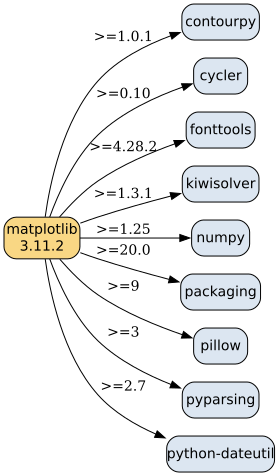
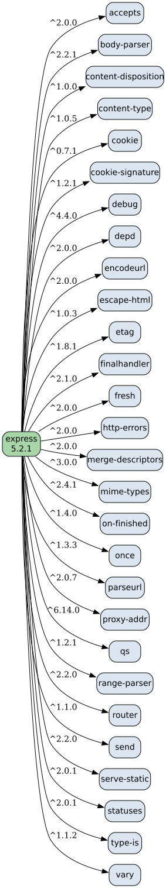

# Практика 2
## Немного теории
Менеджер пакетов — тул, который качает и ставит пакеты и разруливает их зависимости и версии (pip, npm, apt...). Сам пакет — это код + манифест с метаданными: имя, версия, зависимости, лицензия. У Python это файл `METADATA` внутри `*.dist-info`, у JS — `package.json`.

Программы со встроенным пакетным менеджером: Node.js (в комплекте npm), Dart (pub), go (go mod прямо в команде go), dotnet (NuGet), Emacs (package.el), VS Code (маркет расширений).

---

## Задание 1
Ставим и смотрим служебную информацию: `pip install matplotlib`, затем `pip show matplotlib`
```
Name: matplotlib
Version: 3.11.2
Summary: Python plotting package
Author: John D. Hunter, Michael Droettboom
License: License agreement for matplotlib versions 1.3.0 and later ...
Location: /usr/lib/python3.11/site-packages
Requires: contourpy, cycler, fonttools, kiwisolver, numpy, packaging, pillow, pyparsing, python-dateutil
Required-by:
```

Сам файл служебной информации лежит рядом с пакетом: `site-packages/matplotlib-3.11.2.dist-info/METADATA`. Смотрим его:
```
grep -E "^(Metadata-Version|Name|Version|Summary|Requires-Python|Requires-Dist)" $(pip show matplotlib | grep Location | awk '{print $2}')/matplotlib-*.dist-info/METADATA
```
```
Metadata-Version: 2.1
Name: matplotlib
Version: 3.11.2
Summary: Python plotting package
Requires-Python: >=3.11
Requires-Dist: contourpy>=1.0.1
Requires-Dist: cycler>=0.10
Requires-Dist: fonttools>=4.28.2
Requires-Dist: kiwisolver>=1.3.1
Requires-Dist: numpy>=1.25
Requires-Dist: packaging>=20.0
Requires-Dist: pillow>=9
Requires-Dist: pyparsing>=3
Requires-Dist: python-dateutil>=2.7
```

Без менеджера пакетов, прямо из репозитория: пакет — это просто файлы в гите. `git clone https://github.com/matplotlib/matplotlib` (или скачать .tar.gz архив с GitHub/PyPI прямой ссылкой).

---

## Задание 2
Из папки pr_2: `npm install express`, затем `npm view express` и `cat node_modules/express/package.json`
```
name = 'express'
version = '5.2.1'
description = 'Fast, unopinionated, minimalist web framework'
license = 'MIT'
repository.url = 'git+https://github.com/expressjs/express.git'
engines = { node: '>= 18' }
dependencies = {
  accepts: '^2.0.0',
  body-parser: '^2.2.1',
  cookie: '^0.7.1',
  debug: '^4.4.0',
  finalhandler: '^2.1.0',
  ... всего 28 штук
}
```

Без менеджера пакетов: `git clone https://github.com/expressjs/express` либо напрямую из реестра:
```
curl -O https://registry.npmjs.org/express/-/express-5.2.1.tgz
tar xzf express-5.2.1.tgz
```
Внутри готовый пакет (папка `package/` с package.json) — кидаем его в node_modules или требуем по пути, npm не нужен.

---

## Задание 3
Graphviz-код зависимостей (рёбра — прямые зависимости, на рёбрах range из метаданных): `files/matplotlib_deps.dot`
```
digraph matplotlib_deps {
    rankdir=LR;
    node [shape=box, style="rounded,filled", fillcolor="#dce6f1", fontname="Helvetica"];
    "matplotlib" [label="matplotlib\n3.11.2", fillcolor="#f9d784"];

    "matplotlib" -> "contourpy"       [label=">=1.0.1"];
    "matplotlib" -> "cycler"          [label=">=0.10"];
    "matplotlib" -> "fonttools"       [label=">=4.28.2"];
    "matplotlib" -> "kiwisolver"      [label=">=1.3.1"];
    "matplotlib" -> "numpy"           [label=">=1.25"];
    "matplotlib" -> "packaging"       [label=">=20.0"];
    "matplotlib" -> "pillow"          [label=">=9"];
    "matplotlib" -> "pyparsing"       [label=">=3"];
    "matplotlib" -> "python-dateutil" [label=">=2.7"];
}
```
и `files/express_deps.dot` (там express -> 28 зависимостей, вид такой же). Рендерим:
```
dot -Tpng files/matplotlib_deps.dot -o files/matplotlib_deps.png
dot -Tpng files/express_deps.dot -o files/express_deps.png
```




---

## Задание 4
Constraint programming: объявляем переменные с доменами, пишем ограничения, решатель сам ищет назначение (satisfy) или оптимум (minimize/maximize). Ставим MiniZinc (IDE с minizinc.org), модель — `files/task_4.mzn`, запуск из pr_2: `minizinc --solver Gecode files/task_4.mzn` (или кнопку Run в IDE).
```
array[1..6] of var 0..9: d;                              % цифры билета
constraint sum(i in 1..3)(d[i]) = sum(i in 4..6)(d[i]);  % билет счастливый
constraint all_different(d);                             % все цифры различны
var 0..27: s = sum(i in 1..3)(d[i]);                     % сумма первых трёх
solve minimize s;
output ["ticket: " ++ show(d) ++ "   sum = " ++ show(s)];
```
```
ticket: [0, 2, 6, 1, 3, 4]   sum = 8
==========
```
Минимальная сумма трёх цифр = **8**, пример билета 026134 (0+2+6 = 1+3+4, все цифры разные). Без all_different минимум был бы 0 (билет 000000), но с различными цифрами суммы 3..7 не раскладываются на два непересекающихся набора из трёх цифр, первое возможное разложение — 8 = {0,2,6} + {1,3,4}. Конкретный билет при сумме 8 IDE может вывести любой (их несколько), сумма всегда 8.

---

## Задание 5
Данные с рисунка: root зависит от menu ^1.0.0 и icons ^1.0.0; menu 1.1.0–1.5.0 зависят от dropdown ^2.0.0, menu 1.0.0 — от dropdown ^1.0.0; dropdown 2.0.0–2.3.0 зависят от icons ^2.0.0, dropdown 1.8.0 — от icons ^1.0.0. Модель `files/task_5.mzn` (версии занумерованы, 0 = не ставим):
```
var 0..6: menu;
var 0..5: dropdown;
var 0..2: icons;

constraint menu >= 1 /\ menu <= 6;      % root: menu ^1.0.0
constraint icons = 1;                   % root: icons ^1.0.0 (<2.0.0)
constraint (menu >= 2) -> (dropdown >= 2);   % menu >=1.1.0 -> dropdown ^2.0.0
constraint (menu = 1)  -> (dropdown = 1);    % menu 1.0.0  -> dropdown ^1.0.0
constraint (dropdown >= 2) -> (icons = 2);   % dropdown >=2.0.0 -> icons ^2.0.0
constraint (dropdown = 1)  -> (icons = 1);   % dropdown 1.8.0  -> icons ^1.0.0
solve satisfy;
```
(вывод версий строками — в конце файла через fix()). Решение:
```
menu 1.0.0
dropdown 1.8.0
icons 1.0.0
==========
```

Логика: root держит icons <2.0.0 => icons 1.0.0; значит dropdown >=2.0.0 нельзя (он просит icons ^2.0.0), а значит нельзя и menu >=1.1.0 (они все просили dropdown ^2.0.0) => menu 1.0.0 => dropdown 1.8.0.

---

## Задание 6
Модель `files/task_6.mzn`:
```
var 0..2: foo;      % 1:1.0.0 2:1.1.0
var 0..1: left;     % 1:1.0.0
var 0..1: right;    % 1:1.0.0
var 0..2: shared;   % 1:1.0.0 2:2.0.0
var 0..2: target;   % 1:1.0.0 2:2.0.0

constraint foo >= 1 /\ foo <= 2;         % root: foo ^1.0.0
constraint target = 2;                   % root: target ^2.0.0
constraint (foo = 2) -> (left = 1 /\ right = 1);  % foo 1.1.0
constraint (left = 1) -> (shared >= 1);           % left: shared >=1.0.0
constraint (right = 1) -> (shared = 1);           % right: shared <2.0.0
constraint (shared = 1) -> (target = 1);          % shared 1.0.0: target ^1.0.0
% ставим только нужное:
constraint (left > 0)   -> (foo = 2);
constraint (right > 0)  -> (foo = 2);
constraint (shared > 0) -> (left > 0 \/ right > 0);
solve satisfy;
```
Решение:
```
foo 1.0.0
left not installed
right not installed
shared not installed
target 2.0.0
==========
```
Почему: root уже взял target ^2.0.0 => target 2.0.0. Пробуем foo 1.1.0: left хочет shared >=1.0.0, right хочет shared <2.0.0 => подходит только shared 1.0.0, а она тянет target ^1.0.0 — конфликт с target 2.0.0. Откат => foo 1.0.0 без зависимостей, left/right/shared вообще не ставятся.

---

## Задание 7
Теперь то же самое в общей форме, как у настоящего менеджера: метаданные лежат в словаре (такой словарь реальный PM получает из реестра — PyPI JSON / npm registry), а система ограничений строится по нему автоматически. Скрипт `files/task_7.py`:
```
METADATA = {
    "foo":    {"1.0.0": {},
               "1.1.0": {"left": ("1.0.0", "2.0.0"), "right": ("1.0.0", "2.0.0")}},
    "left":   {"1.0.0": {"shared": ("1.0.0", None)}},
    ...
}
ROOT = {"foo": ("1.0.0", "2.0.0"), "target": ("2.0.0", "3.0.0")}
```
`build_mzn()` проходится по словарю и генерирует модель: на каждый пакет переменная `var 0..N`, на каждое требование root и каждую зависимость каждой версии — импликация с range-ом индексов версий, плюс ограничение "ставим только то, что понадобилось". Запуск:
```
python3 files/task_7.py        # данные задачи 6
python3 files/task_7.py t5     # те же генератор на данных задачи 5
```
Скрипт пишет `files/task_7.mzn` и гоняет его через `minizinc`, если он стоит; иначе решает перебором для самопроверки. Кусок сгенерированной модели:
```
var 0..2: foo;
...
constraint foo >= 1 /\ foo <= 2;  % root: foo
constraint (foo = 2) -> (left >= 1 /\ left <= 1);  % foo 1.1.0 -> left
constraint (left = 1) -> (shared >= 1 /\ shared <= 2);  % left 1.0.0 -> shared
constraint (shared > 0) -> ((left = 1) \/ (right = 1));
```
Вывод:
```
solutions: 1
foo 1.0.0
left not installed
right not installed
shared not installed
target 2.0.0
```
Для `t5` генератор без правок выдаёт menu 1.0.0 / dropdown 1.8.0 / icons 1.0.0 — то есть ограничения больше не прописаны руками в модели, а получены из метаданных, как и должно быть у пакетного менеджера.
